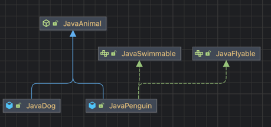
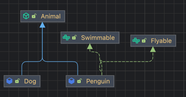
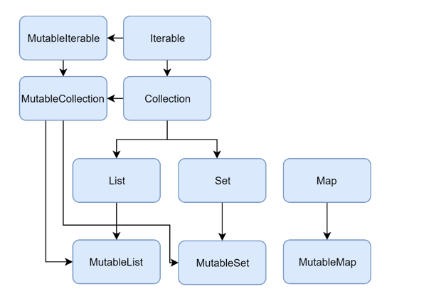

## 1. 변수

### 1.1. 일반적인 변수 선언

```java
// [Java]
long num1 = 10L; // (1)
final long num2 = 10L; // (2)

Long num3 = 1_000L; // (3)
Person person = new Person("Jack"); // (4)
```

- Java 에서 long 과 final long 의 차이 : 가변인가 불변인가..

```kotlin
var num1 = 10L // val num1: Long = 10L 가능 
val num2 = 10L
```

- 코틀린에서는 `var`, `val` 을 명시 필요
  - `var` : 변경 가능
  - `val` : 변경 불가능
- 타입을 명시적으로 작성해도되지만 값을보고 추론할 수있음
- 초기화 되지 않은 변수는 사용하지 못함 (컴파일 에러)


### 1.2. null ? 

#### null 이 가능한 변수로 호출!?

```kotlin
var num3: Long? = 10L
var person = Person("Jack")
```

- `null` 이 들어갈 수 있는 변수타입은 타입뒤에 `?` 붙여줘야함

```kotlin
val str: String? = "aaa"
str.length // compile error
str?.length // ok
str!!.length // ok 
```

- null 이 가능한 타입의 변수라면 해당 변수로 호출할 수 있는 메소드는 safe call 로 명시해야함
  - safe call : `인스턴스변수명?.메소드()` 
  - null 일 때는 호출하지 않음 
- 또는 이 변수는 무조건 때려죽여도 null 이 아니야!! 라고 단언(assertion) 호출로 넘어갈수도있음
  - assertion call : `인스턴수변수명!!.메소드()`  
  - null 일 때는 NPE 발생 

#### 엘비스(Elvis) 연산자

```kotlin
val str: String? = "aaa"
val strLen = str?.length ?: 0 // 3이 저장됨. 만약 str 에 null 이 저장될수있는 경우라면 0 저장
```

- `?:` 의 앞의 연산 결과가 null 이면 뒤의 값을 사용 

### 1.3. 타입

#### 타입 형변환

```java
int num1 = 100;
long num2 = num1;

System.out.println(num1 + num2); // 200
```

- Java 에서는 더 큰 타입으로 암시적 형변환 됨

```kotlin
val num1 = 4
val num2: Long = num1 // compile error

val num3: Long = num1.toLong()
```

- 코틀린에서 데이터 타입이 맞지 않게 대입하려고하면  compile error
- `toXXX()` 형태의 메소드를 사용하여 명시적으로 형변환 필요 

```kotlin
fun convert(child: Child) {
    if (child is Parent) {
        val parent = child as Parent // as ~ 는 생략 가능. if 안에 들어온다면 컴파일러가 해당 타입 변환가능하다고 판단
        // ...
    }
}
```

#### Any, Unit, Nothing

##### Any

- Java 의 Object 와 대응 (모든 타입, 클래스의 최상위 타입)
- null 을 저장할수있는 타입이라면 Any? 로 표현 가능 

##### Unit

- Java 의 void 와 동일한 역할

##### Nothing

- 함수가 정상적으로 끝나지 않았다는 것을 표현하는 역할
- 무조건 예외를 반환하는 함수/ 무한루프 함수 등...

#### String

```kotlin
val student = Student("Jackson", 30)  // name : Jackson, age : 30
val log = "누규? ${student.name}, 몇짤? : ${student.age}"
```

- 문자열 내에 변수의 값을 표현하고 싶으면 `$`, `${}` 사용 가능

```kotlin
val str = """ 
            aaa
            bbb
            123
        """.trimIndent()

println(str)
/*  출력은 다음과 같음...
aaa
bbb
123
 */
```

- 큰 따옴표 3개로 감싸면 개행이 여러개 포함된 문자열을 편하게 표현 가능 

```kotlin
val str = "abcdefg"
val char = str[3] // d
```

- 배열을 참조하는 것 처럼 인덱스로 문자 획득 가능 

### 1.4. 연산자

#### ===, == (동일성, 동등성 비교)

- 기본적인 단항연산자, 산술연산자, 산술대입 연산자등은 모두 Java 와 동일 
- Kotlin 에서는 객체 비교연산자를 사용하여 비교가 가능한데, 이때 내부적으로 `compareTo()` 를 호출하여 비교 함

| Lang    | 인스턴스의 동일성 비교 | 의미한 값의 동등성 비교              |
|---------|--------------|----------------------------|
| Java    | `==`         | equals()                   |
| Kotlin  | `===`        | `==` 사용시 간접적으로 equals() 사용 |


```java
// [Java]

public class Money {
    private final long amount;
    public Money(long amount) { this.amount = amount; }
    @Override
    public boolean equals(Object o) {
        if (this == o) return true;
        if (o == null || getClass() != o.getClass()) return false;
        Money money = (Money) o;
        return amount == money.amount;
    }
}

// ...

public static void main(String [] args) {
    Money m1 = new Money(100);
    Money m2 = m1;
    Meney m3 = new Meney(100);
    
    System.out.println( m1 == m2 ); // true
    System.out.println( m1 == m3 ); // false 
    System.out.println( m1.equals(m3)); // true
}
```

```kotlin
  val m1 = Money(100L)
  val m2 = m1
  val m3 = Money(100L)

  println(m1 === m2)  // true
  println(m1 == m2)  // true - equals() 호출됨
  println(m1 == m3) // true - equals() 호출됨 
  println(m1 === m3) // false
```

#### 컬렉션이나 범위에 포함되어있는지 여부 확인 연산자

- `in` / `!in` 
  - 컬렉션이나 범위에 포함 / 미포함 
- `a..b`
  - a 부터 b 까지 범위 객체를 생성
- `a[i]`
  - a 에서 특정 인덱스로 값을 가져옴 (컬렉션, 문자열 등등)

## 2. 제어문

### 2.1. if 문

```kotlin
  if (...) {
      // ...
  } if else (...) {
      // ...
  } else {
      // ...
  }
```

- 기본적으로 완전 동일
- Statement : 프로그램 문장, 특정 값으로 리턴할 수 없음
- Expression : 특정한 하나의 값으로 리턴할 수 있음 

> Java 에서의 if-else 는 Statement <br>
> Kotlin 에서의 if-else 는 Expression

```kotlin

val score = if(grade == "A") 100 else 50

// ----

fun convertScore(x) {
    if (grade == "A") {
        return 100
    } else {
        return 50
    }
}

// ---

fun convertScore(x) {
  return if (grade == "A") {
     100
  } else {
     50
  }
}

// ---

fun convertScore(x) = if (grade == "A") 100 else 50
``` 
 
- Kotlin 에서는 위와 같이 if-else 이 Expression 라서 위와 같은 표현이 가능 

```kotlin
if (0 <= score && score <= 100) { 
    // ...
}

if (score in 0..100) {
    // .. 위와 동일 
}
```
- 범위의 조건 체크할때 위와 같은 방식 둘 다 가능 

```kotlin
if (score !in 0..100) {
    // .. 0 보다 작거나 100 보다 큰 조건..
}
```

### 2.2. switch, when

```kotlin
  when (score / 10) {
    10, 9 -> "A"
        8 -> "B"
        7 -> "C"
    else -> "F"
  }

  when (score) {
      in 90..100 -> "A"
      in 80..89  -> "B"
      in 70..79  -> "C"
      else -> "F"
  }
```

- switch 문 대신에 when 사용 
- 조건 체크하는 부분에는 enum, 값, in 연산자를포함한 어떠한 Expression 도 가능 (ex : is Type)
- if 와 동일하게 when 자체도 Expression 이라서 특정 변수에 대입도 가능. when 구절 앞에서 return 가능 

## 3. 반복문

### for-each

```java
// [Java]
List<Integer> numbers = Arrays.asList(10, 20, 30);
for (int number : numbers) {
    System.out.println(number);
}
```

```kotlin
// [Kotlin]
val numbers = listOf(10, 20, 30)
for (number in numbers) {  // in 뒤에는 iterable 이 구현된 타입이라면 모두 들어갈 수 있음 
    println(number)
}
```

### for 문 / Range / Progression

```java
// [Java]
for (int i=1; i<=3; i++) { // 1부터 3 까지
    System.out.println(i);    
}
```
```kotlin
// [Kotlin]
for (i in 1..3) { // 1부터 3 까지
    println(i)
}

for (i in 1..<3) { // 1부터 2 까지
  println(i)
}

for (i in 1..10 step 2) {
    println(i)  // 1 3 5 7 9
}

for (i in 3 downTo 1) { // 3 부터 1 까지 
    println(i)
}

for (i in 5 downTo 1 step 2) {
    println(i)  // 5 3 1
}
```

```kotlin
var i = 1
while (1 <= 3) {
    println(i)
  i++
}
```
- while 은 Java 와 동일 

[Range 와 Progression 관련 문서](https://kotlinlang.org/docs/ranges.html#progression)

## 4. 예외 다루기 

### try catch

```java
// [Java]
public int parseIntOrThrow(@NotNull String str) {
    try {
        return Integer.parseInt(str);
    } catch (NumberFormatException e) {
        throw new IllegalArgumentException(String.format("$s is NOT a number", str));
    }
}
```

```kotlin
// [Kotlin]
fun parseIntOrThrow(str: String): Int {
    try {
        return str.toInt() 
    } catch (e: NumberFormatException) {
        throw IllegalArgumentException("$str is NOT a number ")
    }
}
```
- 기본적인 사용법은 동일함 
- 참고 : 기본 타입간의 형변환은 각 Type Class 에 있는 메소드인 `toXXX()` 메소드를 사용

```kotlin
// [Kotlin]
fun parseIntOrThrow(str: String): Int? {
   return try {
       str.toInt()
   } catch (e: NumberFormatException) {
       null
   }
}
```

- Kotlin 에서는 try~catch 도 Expression 이라서 위와 같이 사용 가능  
- Kotlin 에서는 Checked Exception 도 모두 Unchecked Exception 처럼 취급.
- 따라서 별도로 throws 를 하거나 try~catch 를 강제하지 않아도 도미

### try with resources 

```java
public void readFile(String path) throws IOException {
    try (BufferedReader bufferedReader = new BufferedReader(new FileReader(path))) {
        System.out.println(bufferedReader.readLine()); 
    }
}
```
- 위 Java 메소드는 파일을 읽어 한줄 출력.
- 위와 같이 사용하면 `AutoClosable` 을 구현한 `BufferedReader` 객체는 알아서 `close()` 호출되어 정리됨 

```kotlin
fun readFile(path: String) {
    BufferedReader(FileReader(path)).use { reader ->
        println(reader.readLine())
    }
}
```

- Kotlin 에는 try~with~resources 구문이 없음
- 유사하게 사용하고자 한다면 `use { }` 와 같은 확장함수를 사용해서 동일한 동작 가능

## 5. 함수 

### 함수 선언

```kotlin
// [Kotlin]
// 1)
public fun sum(a: Int, b: Int): Int {
    return a + b
}

// 2)
fun sum(a: Int, b: Int): Int {
	return a + b
} 

// 3)
fun sum(a: Int, b: Int) = a + b

```

- public 생략 가능. 생략하면 public 으로 선언됨
- 클래스 내부, 외부 선언가능. 한 파일안에 여러개 선언 가능  

### Parameter - Default argument

```kotlin
// [Kotlin]
fun repeatPrint(str: String, count: Int = 3, newLine: Boolean = true) {
    for (i in 1..count) {
        print(str)
        if (newLine) {
            println()
        }
    }
}
```

### Parameter - Named argument

```kotlin
// [Kotlin]
// 위의 함수를 호출. 단, count 는 default arg  를 사용하고 newLine 은 false 로 사용하고 싶다면
repeatPrint("Hello", newLine = false)
```
- 매개변수 이름을 통해 직접지정, 지정되지 않은 매개변수는 default arg 사용
- 해당 기능을 이용해 Builder 패턴을 구현할 수 있음
- 단, Java 의 함수를 호출하여 사용하고자하면 Named argument 를 사용할 수 없음

### 가변인자 파라미터

```java
// [Java]
public static void printAll(String... args) {
    for (String arg : args) {
        System.out.println(arg);
    }
}
```

- 배열을 통해 전달하거나, 각 args 를 직접 comma 로 구분하여 전달 가능

```kotlin
// [Kotlin]
fun printAll(vararg args: String) {
    for (arg in args) {
        println(arg)
    }
}

// ---
fun main() {
    printAll("aaa", "bbb", "ccc")
    val array = arrayOf("xxx", "yyy", "zzz")
    printAll(*array)  // spread operator
}
```

- `vararg` 키워드를 사용하여 가변인자 파라미터를 사용 가능
- 배열을 전달할때는 `*(spread operator)` 를 사용하여 전달

[코틀린 문서 - 함수 및 파라미터 등](https://kotlinlang.org/docs/functions.html#named-arguments)

## 6. 클래스 

### 클래스, 프로퍼티

```java
// [Java]
public class Person {
    private final string name;
    private int age;
    
    public Person(String name, int age) {
        this.name = name;
        this.age = age;
    }
    
    public String getName() { return this.name; }
  
    public int getAge() { return this.age; }
  
    public void setAge(int age) { this.age = age; }
}
```

```kotlin
// [Kotlin]
class Person constructor(name: String, age: Int){
    val name = name 
    var age = age
}

// constructor 키워드 생략 가능 
class Person(name: String, age: Int){
  val name = name
  var age = age
}

// 생성자에서 프로퍼티를 만들수있어서 아래와 같이 단순화 시킬 수 있음 
// 아래에서는 Body 에 아무것도 없기때문에 생략 가능 
class Person(val name: String, var age: Int)
```

- 코틀린에서는 필드만 만들면 getter, setter 를 자동으로 만들어줌 

```kotlin
// [Kotlin]
val person = Person("Jack", 20)
println(person.name)
person.age = 30
println(person.age)
```

- `Person` 클래스의 name getter, age setter/getter 는 이름으로 바로 사용 가능 

### 생성자, init

```kotlin
// [Kotlin]
class Person(val name: String, var age: Int) {
    init {
        if (age < 0) {
            throw IllegalArgumentException("잘못된 나이 : $age")
        }
    }
}
```

- 객체가 생성되는 시점에 무언가 하고싶다면? init!!

```kotlin
// [Kotlin]
class Person(val name: String, var age: Int) { // 주 생성자 (Primary Constructor)
  init {
    if (age < 0) {
      throw IllegalArgumentException("잘못된 나이 : $age")
    }
  }
  
  constructor(name: String): this(name, 1) // 생성자 오버로딩 (부 생성자 : Secondary Constructor)
}
```

- 생성자 오버로딩은 `constructor` 키워드를 Body 안에 기술해서 사용 가능
- 주 생성자 (Primary Constructor) 는 반드시 존재해야 함 
- 부 생성자 (Secondary Constructor) 는 body 를 가질 수 있음 
- default parameter 를 활용하여 생성자 오버로딩을 하지 않고도 동일한 역할 가능 


### Custom getter, setter

```kotlin
// [Kotlin]
class Person(
  val name: String, 
  var age: Int
) { 
    // 메소드로 만들기..
    fun isAdult(): Boolean {
        return this.age >= 20
    }
    
    // Custom getter 1
    val isAdult: Boolean
      get() = this.age >= 20
  
    // Custom getter 2
    val isAdult: Boolean
      get() {
          return this.age >= 20
      }
}
```
- 프로퍼티 인 것 처럼 custom getter/setter 를 만들어서 사용가능
- 용도는 동일하니 알맞게 정해서 사용하면 됨

## 7. 클래스의 상속



```java
// [Java]
public abstract class JavaAnimal {

  protected final String name;
  protected final int legCount;

  public JavaAnimal(String name, int legCount) {
    this.name = name;
    this.legCount = legCount;
  }

  abstract public void speak();

  public String getName() { return this.name; }

  public int getLegCount() { return this.legCount; }
}
```
```java
public class JavaDog extends JavaAnimal{

  public JavaDog(String name) {
    super(name, 4);
  }

  @Override
  public void speak() { System.out.println("멍멍"); }
}
```
```java
public interface JavaFlyable {

  default void doIt() { System.out.println("난다!!"); }
  
}
```
```java
public interface JavaSwimmable {

  default void doIt() { System.out.println("자유형!?!고고"); }
}
```
```java
public class JavaPenguin extends JavaAnimal implements JavaFlyable, JavaSwimmable {

  private final int wingCount;

  public JavaPenguin(String name) {
    super(name, 2);
    this.wingCount = 2;
  }

  @Override
  public void speak() { System.out.println("짹~"); }

  @Override
  public int getLegCount() {
    return super.legCount + this.wingCount;
  }

  @Override
  public void doIt() {
    JavaFlyable.super.doIt();
    JavaSwimmable.super.doIt();
  }
}
```



- 코틀린으로 동일하게...

```kotlin
// [Kotlin]
abstract class Animal(
    protected val name: String,
    protected open val legCount: Int, 
) {
    abstract fun speak()
}
```
- 코틀린에서는 프로퍼티를 override 하려면 open 키워드로 명시해줘야함.
- 단, 추상 프로퍼티의 경우는 open 을 사용하지 않아도 가능 

```kotlin
class Dog(
  name: String
) : Animal(name, 4) {

  override fun speak() { println("멍멍")  }

}
```
- 상속은 콜론(`:`) 으로~
- 오버라이드가 필요하면 `override` 키워드로 명시

```kotlin
interface Flyable {

    fun doIt() { println("난다!!") } // Java 에서의 default method
}
```

```kotlin
interface Swimmable {

    fun doIt() { println("자유형!!고고")} // Java 에서의 default method
}
```
- 코틀린에서는 default 키워드 없이 인터페이스에서 메소드 구현체 기술 가능

```kotlin
class Penguin(
    name: String,
) : Animal(name, 2), Flyable, Swimmable{

    private val wingCount: Int = 2

    override fun speak() { println("짹") }

    // override 키워드로 부모클래스의 legCount 프로퍼티를 오버라이딩. 
    // customer getter 로 기능 구현
    override var legCount: Int = 0
        get() = super.legCount + this.wingCount

    override fun doIt() {
        super<Flyable>.doIt() // 중복되는 인터페이스를 특정할때는 super<타입>.메소드 형태로 사용
        super<Swimmable>.doIt()
    }
}
```

- 상속 및 인터페이스 구현 모두 콜론(`:`)으로~

### 상속 관련 지시어 정리

- `final` : 오버라이딩을 할 수 없게함. default 로 보이지 않게 존재하고 있음
- `open` : 오버라이딩 할 수 있게 열어줌
- `abstract` : 반드시 오버라이딩 해야도록 명시
- `oeverride` : 상위 타입을 오버라이딩 하는 것이라고 명시

## 8. 접근 제어

### 자바와 코틀린의 접근 제어

#### Java

| 접근제어 키워드  | 접근 가능한 곳                         |
|-----------|----------------------------------|
| public    | 모든 곳에서 접근 가능                     |
| protected | 같은 패키지 또는 하위 클래스에서만 접근 가능        |
| default   | 같은 패키지에서만 접근 가능                   |
| private   | 선언된 클래스 내에서만 접근 가능              |

#### Kotlin

| 접근제어 키워드 | 접근 가능한 곳                                   |
|-----------|----------------------------------|
| public          | 모든 곳에서 접근 가능                            |
| protected       | `선언된 클래스` 또는 하위 클래스에서만 접근 가능 |
| internal        | 같은 모듈에서만 접근 가능

- default 는 사라졌음 
- 위에서 말하는 모듈은 IDEA module, Maven Project, Gradle Srouce set 등의 컴파일 파일의 집합


### 다양한 구성요소의 접근 제어 

- 생성자에 접근 지시어를 사용하고 싶으면 명시적으로 `constructor` 를 써줘야함 

```kotlin
class Person private constructor(
    val name: String,
)
```

## 9. object 키워드 

### static 함수, 변수

```java
// [Java]
public class JavaCharacter {

  private static final int MIN_LEVEL = 1;

  public static JavaCharacter newCharacter(String name) {
    return new JavaCharacter(name, MIN_LEVEL);
  }

  private String name;

  private int level;

  private JavaCharacter(String name, int level) {
    this.name = name;
    this.level = level;
  }
}
```
```kotlin
class Character private constructor(
    val name: String,
    val level: Int,
) {
    companion object {
        private const val MIN_LEVEL = 1
        fun newCharacter(name: String): Character {
            return Character(name, MIN_LEVEL)
        }
    }
}
```
- `static` 키워드 없음 
- `companion object` 는 일반적으로 이름을 붙이지 않음. 하지만 이름 붙이는것도 가능 
- 다른 인터페이스를 구현하는것도 가능 

### 싱글톤 (object)

```kotlin
object Character {
    var num: Int = 0
}

// 사용하려면?
Character.num // 바로 접근 가능
```

- 언어 레벨에서 싱글톤을 만들수있는 키워드


### 익명 클래스 

```kotlin
interface MyAction {
  fun fun1()
  
  fun fun2()
}

// ...

fun main() {
    doSoemthing(object : MyAction {   // object 키워드로 익명 클래스 사용 
        override fun fun1() { println("fun1() !!!")}
        override fun fun2() { println("fun2() !!!")}
    })
}

fun doSomething(action: MyAction) {
    action.fun1() 
    action.fun2()
}
```

[코틀린 문서 - object, companion object](https://kotlinlang.org/docs/object-declarations.html)

## 10. 그 외 다양한 클래스

### data class

```kotlin
data class Person(
    var name: String,
    var age: Int,
)
```
- class 앞에 `data` 키워드만 적으면 됨 
- `getter`, `setter`, `equals`, `hashCode`, `toString` 을 알아서 만들어줌 

### enum class

```kotlin
enum class Country(
  private val code: String,
) {
  KOREA("KO"),
  AMERICA("US"),
  //..
}
```

### sealed class sealed interface

```kotlin
sealed class Car(
    val name: String,
    val price: Long,
)

class Genesis : Car("제네시스", 1_000L)

class Tesla : Car("테슬라", 2_000L)

class Ferrari : Car("페라리", 3_000L)

// .....

fun handleCar(car: Car) {
    when (car) {
        is Genesis -> TODO()
        is Tesla -> TODO()
        is Ferrari -> TODO()
    }
}

```

- 상속이 가능하도록 추상클래스를 만들고싶은데, 외부에서는 이 클래스를 상속받았지 않았면?
- 컴파일 타임 때 하위 클래스의 타입을 모두 기억 
- 런타임 때 클래스 타입 추가될 수없음.
- 하위 클래스는 같은 패키지에 있어야함
- enum 을 when 에 사용할때처럼 좀 더 편하게 사용 가능 

> enum 과 다른점
> 클래스를 상속 받을 수 있음
> 하위 클래스는 멀티 인스턴스가 가능 

## 11. 배열과 컬렉션 다루기

### 배열

```kotlin
val array = arrayOf(100, 200) // Array<Int>

for (i in array.indices) { // 인덱스를 획득
    println("$i : ${array[i]}")
}

for ((idx, value) in array.withIndex()) { // 인덱스와 값을 동시에 획득 s 
    println("$idx : $value")
}
```

### Collection - List, Set Map



```kotlin
    // 리스트 사용하기
val numbers1 = listOf(10, 20)
val numbers2 = mutableListOf(10, 20)
numbers2.add(30)
val emptyList1 = emptyList<String>()

for (number in numbers1) {
  println(number)
}

for ((idx, value) in numbers2.withIndex()) {
  println("$idx: $value")
}

val lists = mutableListOf<String>()
lists.add("aaa")
lists.add("bbb")

for (value in lists) {
  println(value)
}

// 셋 사용하기
val setNumbers = setOf(10, 20)
for (number in setNumbers) {
  println(number) // list 사용 법은 동일
}

// 맵 사용하기 
val oldMap = mutableMapOf<Int, String>()
oldMap[1] = "AAA" // java 처럼 put 을 사용해도 됨
oldMap[2] = "BBB"

for (key in oldMap.keys) {
  println("$key: $oldMap[$key]")
}

val newMap = mapOf(1 to "XXX", 2 to "YYY", 3 to "ZZZ")

for ((key, value) in newMap) { // .entries?
  println("$key: $value")
}
```

- 불변 인지, 가변인지 먼저 고려 필요
- 불변이라하더라도 기존에 존재하는 element 의 내부 값은 수정가능 (element 자체의 추가/삭제가 안됨)


[코틀린 문서 - Collections](https://kotlinlang.org/docs/collections-overview.html#collection-types)

## 12. 함수 다루기

### 확장 함수

```kotlin
// [Kotlin]
fun 확장하려는클래스.함수명(파라미터): 리턴타입 {
    // this 를 이용해 실제 클래스안의 값에 접근 
}

// ex)
fun String.lastChar(): Char {
  return this[this.length - 1]
}
```

- 기존 Java 코드위에 자연스럽게 코틀린 코드를 추가? 
- 특정 클래스안에 잇는 메소드처럼 호출할 수 있지만, 코드자체는 외부에 작성
- 확장함수에서는 클래스에있는 private, protected 항목을 가져올수없음 (캡슐화 유지)
- 실제 클래스 내부에있는 멤버함수와 동일하다면? 멤버함수가 먼저 호출됨 
- 확장함수가 오버라이드된다면? 정적 타입에 의해 어떤함수가 호출될지 결정됨

### infix 함수

```kotlin

fun Int.add1(other: Int): Int {
    return this + other
}

// 함수 앞에 infix 키워드
infix fun Int.add2(other: Int): Int
{
    return this + other
}

// ....

2.add1(3)  // 5

2.add2(3)  // 5
5 add2 3   // 8. 이런식으로 사용할수있게해줌
```

- 함수를 호출하는 새로운 방법
- downTo, step (infix 호출)

### inline 함수

```kotlin
inline fun test() {
    // ...
}
```
- 함수 호출대신, 해당 부분이 그대로 치환됨 (즉 끼워넣기!!)

### 지역 함수

```kotlin
fun outerFun(num: Int) {
  fun innerFun(num: Int): Int {
      return num * 10
  }
  // todo...
}
```

- 즉, 함수 안에 함수 
- but.. depth 가 깊어지기만해서 굳이 사용하지 않아도 될듯 

[코틀린 문서 - Functions](https://kotlinlang.org/docs/functions.html)

## 13. 코틀린에서의 람다

### 코틀린에서의 람다

- 코틀린에서는 함수가 그 자체로 값이 될수있음
- 그러므로 변수에 할당할수도, 파라미터로 넘길수도 있음

```kotlin
val foods = listOf(
        Food("돈까스", 1_000),
        Food("돈까스", 3_500),
        Food("국수", 2_000),
        Food("국수", 2_500),
        Food("국수", 3_500),
        Food("스테이크", 20_000)
    )

    // 람다를 만드는 방법 (1)
    val isDon1 = fun (food: Food): Boolean {
        return food.name == "돈까스"
    }

    // 람다를 만드는 방법 (2) @@@ - 보통 많이 사용되는 람다 표현식 
    val isDon2 = { food: Food -> food.name == "돈까스" }

    // 람다를 직접 호출 (1)
    println(isDon1(foods[0])) // true
    // 람다를 직접 호출 (2) @@@
    println(isDon2.invoke(foods[2])) // false
```

- 위와 같이 람다를 만드는 방법은 크게 2가지가 존재하고, 호출하는 방법도 2가지가 존재함

```kotlin
fun filterFoods(
    foods: List<Food>,
    filter: (Food) -> Boolean,  // @@@
): List<Food> {
    val results = mutableListOf<Food>()
    for (food in foods) {
        if (filter(food)) {
            results.add(food)
        }
    }
    return results
}
```

- filter 라는 변수는 람다를 전달받을 수 있는데, `Food` 타입을 전달받아 `Boolean` 타입의 값을 리턴하는 람다를 전달받아 내부에서 사용함.

```kotlin
// 호출할때? 
// 람다를 파라미터로 전달할수있음
val noodles = filterFoods(foods, { food: Food -> food.name == "국수" })
noodles.forEach { println(it) }
```
- 위와 같이 람다 표현식을 전달 가능 

```kotlin
val luxuryFoods = filterFoods(foods) { food: Food -> food.price > 5_000 }
luxuryFoods.forEach { println(it) }
```

- 만약 람다형태로 받는 함수의 파라미터가, 파라미터의 순서중 가장 마지막에 있으면, 호출시 소괄호 밖으로 빼서 사용할 수 있도록 허용 

```kotlin
val donFoods = filterFoods(foods) { food -> food.name == "돈까스"}
donFoods.forEach { println(it) }
```
- `filterFoods()` 함수의 파라미터에 타입이 명시되어있어서 컴파일러가 호출시에도 타입을 추론가능함. 따라서 람다에서 파라미터 타입은 생략 가능.

```kotlin
val steakFoods = filterFoods(foods) { it -> it.name == "스테이크 "}
donFoods.forEach { println(it) }
```

- 람다 함수로 전달받는 값이 1개 밖에 없다면 그 파라미터는 `it` 키워드로 표현 가능

```kotlin
val cheapFoods = filterFoods(foods) { food ->
    println("저렴한 것만 고르자!!")
    fruit.price < 3_000
}
```

- 람다는 여러 줄로 작성 가능하며, 마지막 줄의 결과가 람다의 반환값이다 (return 을 명시하지 않음)

[코틀린 문서 - Lambda](https://kotlinlang.org/docs/lambdas.html)

## 14. 컬렉션을 함수형으로 다루기

### filter, map

```kotlin
val foods = listOf(
    Food("라면", 3_000),
    Food("라면", 4_500),
    Food("김밥", 2_000),
    Food("김밥", 2_500),
    Food("어묵", 2_000),
    Food("탕수육", 10_000),
    Food("탕수육", 15_000),
)

println("======================================= 필터")
val ramens = foods.filter { food -> food.name == "라면" }
ramens.forEach { println(it) }

println("======================================= 필터에서 인덱스 사용")
val filterIndexed = foods.filterIndexed { idx, fruit ->
    println("idx: $idx, fruit: $fruit")
    fruit.name == "김밥"
}
filterIndexed.forEach { println(it) }

println("======================================= 필터링 후 매핑")
val expensiveFoods1 = foods.filter { fruit -> fruit.price > 5_000 }
    .map { fruit -> fruit.name }
expensiveFoods1.forEach { println(it) }
```

### 컬렉션 처리

```kotlin
println("======================================= all ")
println(foods.all { it.price > 3_000 } ) // 모든 요소가 조건을 만족 : true

println("======================================= none ")
println(foods.none { it.price > 20_000 } ) // 모든 요소가 조건을 불만족 : true

println("======================================= any ")
println(foods.any { it.price > 10_000 } ) // 모든 요소가 조건을 하나라도 만족 : true

println("======================================= count ")
println(foods.count()) // size 와 동일

println("======================================= sortedBy ")
foods.sortedBy { fruit -> fruit.price }.forEach { println(it) }

println("======================================= sortedByDescending ")
foods.sortedByDescending { fruit -> fruit.price }.forEach { println(it) }

println("=======================================  distinctBy")
foods.distinctBy { it.name }
    .map { it.name }
    .forEach { println(it) }


foods.first() // 무조건 null, emptyList 면안됨.  없으면 에러
foods.firstOrNull() // 없으면 null 반환
foods.last() // 무조건 null, emptyList 면안됨.  없으면 에러
foods.lastOrNull() // 없으면 null 반환
```

### List 를 Map 으로 변환 (groupBy, associateBy)

```kotlin
println("=======================================  groupBy")
val groupingFoods = foods.groupBy { it.name } // Map<String, List<Fruit>>
groupingFoods.keys.forEach { key ->
    println("key: $key")
    groupingFoods[key]?.forEach { println("\t$it") }
}

println("=======================================  groupBy 2")
val groupingFoods2 = foods.groupBy({ it.name }, { it.price }) // Map<String, List<Int>> // 음식이름, List<가격>
groupingFoods2.keys.forEach { key ->
    println("key: $key")
    groupingFoods2[key]?.forEach { println("\t$it") }
}

println("=======================================  associateBy")
val associatedFoodMap = foods.associateBy { it.id }  // Map<Int, Food> // value 쪽에 단일 객체
associatedFoodMap[3]?.let { println(it) }

println("=======================================  associateBy 2")
val associatedFoodMap2 = foods.associateBy( { it.id }, { it.price } )  // K : 아이디, V : 가격
associatedFoodMap2[3]?.let { println(it) }
```

- `groupBy` : 특정 키를 기준으로 그룹핑
- `associateBy` : 특정 키를 기준으로 Map 으로 변환

### 중첩된 컬렉션 처리 

```kotlin
val foodsInList: List<List<Food>> = listOf(
		listOf(
			Food(1, "라면", 3_000),
			Food(2, "김밥", 2_500),
			Food(3, "떡볶이", 3_500),
		),
		listOf(
			Food(4, "짜장면", 5_000),
			Food(5, "짬뽕", 6_000),
		),
		listOf(
			Food(6, "백반", 9_000)
		)
	)

println("=======================================  flatten")
foodsInList.flatten().forEach { println(it) }

println("=======================================  flatMap")
foodsInList.flatMap { list -> list.map { it.name } }.forEach { println(it) }
```

- `flatten` : 내부의 모든 리스트를 평탄하게 같은 레벨로 만들어줌
- `flatMap` : 내부의 리스트를 (매핑)변환하여 하나의 리스트로 만들어줌

## 15. Scope Function

### Scope Function 의 종류

- `apply` / `also` / `run` / `let` / `with`

### Scope Function ??

- 람다를 사용해 일시적인 영역을 형성하는 함수
- method chaning 에 활용

### 

| 함수명   | 반환 값 | 사용하는 객체 | 
|-------|------|----------|
| apply | 객체 자신 | this |
| also  | 객체 자신 | it   |
| run   | 람다 결과 | this |
| let   | 람다 결과 | it   |

```kotlin
val food = Food(1, "라면", 3_000)

	val applyFood = food.apply {
		this.name
	}

	val alsoFood = food.also {
		it.name
	}

	val runFood = food.run {
		this.name
	}

	val letFood = food.let {
		it.name
	}
```

- 위의 예에서 apply, also 는 객체 자신이 반환 됨
- 위의 예에서 run, let 은 람다의 결과 값이 반환 됨

```kotlin
val food = Food(1, "라면", 3_000)

with(food) {
	println(name)
    println(this.price)
}
```

- `with` 는 `run` 과 동일한 역할을 함
- this 를 사용해접근가능하고, 생략 가능 